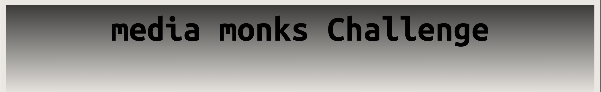

<!-- PROJECT LOGO -->
 

  

<h3 align="center">Media Monks Cookie Challenge</h3>

  

    Built by Sophia Orlando

  <ol>
    <li>
      <a>About The Project</a>
      <ul>
        <li><a href="#built-with">Built With</a></li>
      </ul>
    </li>
    <li>
      <a href="#getting-started">Getting Started</a>
      <ul>
        <li><a href="#prerequisites">Prerequisites</a></li>
        <li><a href="#installation">Installation</a></li>
      </ul>
    </li>
    <li><a href="#usage">Usage</a></li>
    <li><a href="#roadmap">Roadmap</a></li>
    <li><a href="#contributing">Contributing</a></li>
    <li><a href="#license">License</a></li>
    <li><a href="#contact">Contact</a></li>
    <li><a href="#acknowledgments">Acknowledgments</a></li>
  </ol>

<!-- ABOUT THE PROJECT -->
## About The Project

This project stores and saves cookies in your browser. Every time a user visits the page, or refreshes it, they will be presented with a ball. A cookie will be stored every time the user sees a blue ball or a red ball. Once the cookies are cached, the application will refresh and all previous cookies will be deleted. 

(<a href="#readme-top">back to top</a>)

### Built With

* HTML
* CSS
* Javscript
* Google Fonts

(<a href="#readme-top">back to top</a>)

<!-- GETTING STARTED -->
## Getting Started

To set up this application, clone this repository on your machine, or download this folder. Open this project inside of your IDE and open your Live Server. 

Once opened and running on your Live Server, right-click to "Inspect" the page and navigate to "Application", then, "Cookies". Click on the box starting with, "http". There, you will see the created, stored, and updated cookies, everytime you visit or refresh the page. 

Visual Studio
* https://marketplace.visualstudio.com/items?itemName=ritwickdey.LiveServer 

(<a href="#readme-top">back to top</a>)

<!-- ROADMAP -->
## Issues

- [ ] Can not show same color ball user saw previously
- [ ] CSS Styling will be improved

(<a href="#readme-top">back to top</a>)

<!-- CONTACT -->
## Contact

Project Link: [https://github.com/github_username/repo_name](https://github.com/github_username/repo_name)

(<a href="#readme-top">back to top</a>)

